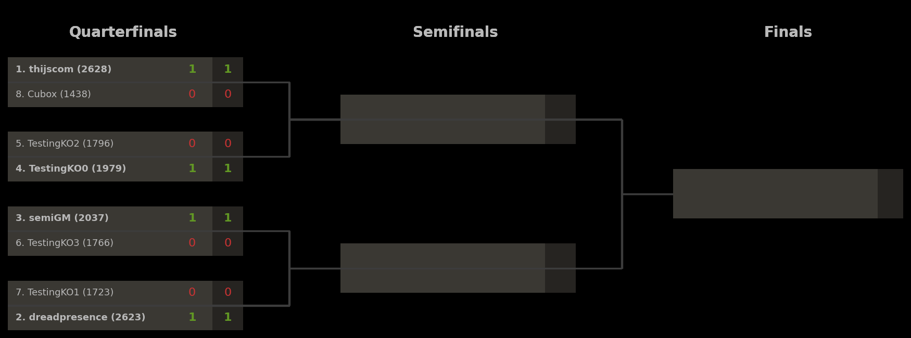
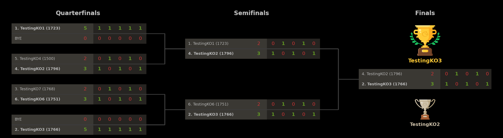
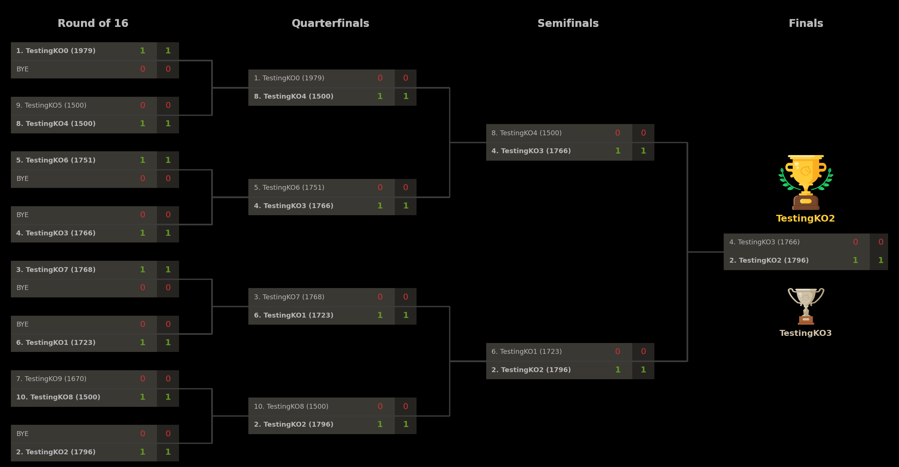

# Lichess Knock-Out Tournament Tool

This repository provides a tool to automatically run (single-elimination) knock-out tournaments on Lichess, making use of Lichess Swiss tournaments with manually-provided pairings. Visualizations of the knock-out brackets are automatically visualized and kept up-to-date, and hosted on GitHub, with a direct link in the tournament description.

## Demos

Below are some examples of tournaments which were run with this tool, and the associated brackets.

#### 1. Example tournament (8 players, 1 game per round, 1+0)
[Tournament URL](https://lichess.org/swiss/AmSDlttV)

#### 2. Example tournament (8 players, 5 games per round, 1/2+0)
[Tournament URL](https://lichess.org/swiss/dO511j56)

#### 3. Example tournament (16 players, 1 game per round, 1/2+0)
[Tournament URL](https://lichess.org/swiss/dO511j56)

## Requirements

To use this, you need to have a Lichess account, and you need to be the team leader of a Lichess team. To run the script in the cloud, you further need a GitHub account. The below description is for the cloud instantiation, as it provides the full functionality of automated visual knock-out bracket generation (similar to e.g. [Challonge](https://challonge.com)) which gets hosted on GitHub and linked in the tournament description, for players to track the progress of the tournament.

To run the script locally, you need to have Python installed with the necessary packages, as outlined in the installation instructions.

For users to join, they need to have a Lichess account and be a member of the same team in which these tournaments are organized.

## Usage

There are two ways to use this tool:
- Create a single tournament instantly by locally running the script;
- Run tournaments on a repeating time schedule by running the script from the cloud.

Both methods of using this script should be fairly straightforward to use, if you follow the steps outlined in this README. If you get stuck getting the tool to work, feel free to contact me for help.

## Installation (short version)

Below are installation instructions which apply both for running the script locally and for running the script on the cloud.
1. Clone this GitHub repository, say to `yourname/lichess-knockout`.
2. Create a GitHub token [here](https://github.com/settings/tokens?type=beta).
3. Create a Lichess token [here](https://lichess.org/account/oauth/token/create?scopes[]=tournament:write&description=Knockout%20Tournament%20Token).
4. *(cloud only)* Store these tokens as secrets `GITHUBTOKEN` and `LICHESSTOKEN` in the GitHub Actions of the repository.
5. Configure the GitHub and Lichess settings in `config.ini`.
6. *(optional)* Configure the other settings in `config.ini` as desired.
7. Depending on whether you want to create a single tournament locally, or create a schedule of tournaments in the cloud, follow one of these steps:
  - Creating a single tournament locally:
    - Download your copy of the repository, run `python main.py config.ini <LICHESSTOKEN> <GITHUBTOKEN>`, and keep the script running until the event is over.
  - Creating a schedule of tournaments in the cloud:
    - Modify the file `.github/workflows/runner.yml` to adjust the time schedule accordingly (see more details below).
    - Simply wait until GitHub Actions starts running and starts creating/hosting events.

## Installation (long version)

1. Clone this GitHub repository, say to `yourname/lichess-knockout`.
2. Create a GitHub token [here](https://github.com/settings/tokens?type=beta).
   - Choose any token name.
   - For expiration, select a year from now for a long-lasting token.
   - Under `Repository access`, select `Only select repositories` and select the repository you just created.
   - Under `Permissions` and `Repository permissions`, find the header `Contents` and set it to `Read and write`.
   - Leave the other default options and click "Generate token".
   - You will see the token in the form of one long string starting `github_...`. **Save this string**, you will need it later. At the same time, do not share this string with anyone, as it would allow others (limited) access to your GitHub repository.
3. Create a Lichess token [here](https://lichess.org/account/oauth/token/create?scopes[]=tournament:write&description=Knockout%20Tournament%20Token).
   - Choose any token name.
   - The only required permission is `tournament:write` and this should automatically be selected when clicking this link.
   - Leave the other boxes unchecked and click "Create token".
   - You will see the token in the form of one long string starting `lip_...`. **Save this string**, you will need it later. At the same time, do not share this string with anyone, as it would allow others (limited) access to your Lichess account.
4. *(cloud only)* Store these tokens as secrets `GITHUBTOKEN` and `LICHESSTOKEN` in the GitHub Actions of the repository.
   - NOTE: These secrets are only used for running the cloud scheduler; when running the script locally, this step can be skipped.
   - One way to go there is to navigate directly to `https://github.com/{yourgithubname}/{yourclonedreponame}/settings/secrets/actions`.
   - Alternatively, navigate to your newly cloned repository on GitHub, choose "Settings" in the top menu, and choose "Secrets and variables" - "Actions" in the left menu.
   - When you reach the right page, make two secrets for the Lichess and GitHub tokens.
       - Click "New repository secret"; use name `GITHUBTOKEN`; paste the GitHub token starting `github_...`; and click "Add secret".
       - Click "New repository secret"; use name `LICHESSTOKEN`; paste the Lichess token starting `lip_...`; and click "Add secret".
5. Configure the GitHub and Lichess settings in `config.ini`.
   - In the repository, find the file `config.ini` and (if doing this through the browser) edit it by clicking the pencil in the top right corner.
   - Under the header [GitHub], paste your GitHub username and GitHub repository name in the appropriate places.
   - Under the header [Lichess], paste the last part of the URL of the team where these tournaments will be hosted.
       - Example: For the team `The Cult` with URL `https://lichess.org/team/the-cult` you would use `the-cult`.
6. *(optional)* Configure the other settings in `config.ini` as desired.
   - In the same file `config.ini`, other parameters under [Options] can be modified to change various tournament settings.
7. Depending on whether you want to create a single tournament locally, or create a schedule of tournaments in the cloud, follow one of these steps:
   - Creating a single tournament locally:
     - Download your copy of the repository to your computer.
     - Navigate to the base folder containing the file `main.py`.
     - Open command line in this folder.
     - Make sure python is installed on your computer; if not, you can install it from [Python.org](https://www.python.org/).
     - Run the command `python main.py config.ini <LICHESSTOKEN> <GITHUBTOKEN>` where you replace `<LICHESSTOKEN>` and `<GITHUBTOKEN>` with your tokens `lip_...` and `github_...`.
     - The output in the command line should guide you through what it is doing, and should soon show that it has successfully created the event.
     - Keep the script running in the background until the tournament is over.
   - Creating a schedule of tournaments in the cloud:
     - Modify the file `.github/workflows/runner.yml` to adjust the time schedule accordingly (see more details below).
     - Simply wait until GitHub Actions starts running and starts creating/hosting events.

## Changing the tournament parameters

The file `config.ini` can be modified to change the parameters of the tournament. For most of these parameters, the same restrictions apply as on the corresponding [Lichess API endpoint](https://lichess.org/api#tag/Swiss-tournaments/operation/apiSwissNew). Some additional details on (the requirements on) these parameters are given below.
- The field `EventName` describes the name for the tournament on Lichess, and is bound by the same constraints as specified in the Lichess API. In particular, special characters (including e.g. exclamation marks) should be avoided, and the maximum length of the tournament name is 30 characters.
- The field `TieBreak` can be set to decide who wins in case a match ends in a tie: the player with the lowest rating (`rating`), or the player with fewer white games (`color`, but only in combination with an odd `GamesPerMatch`).
- The field `MinutesToStart` specifies how soon the event starts after this script starts running. Concretely, this therefore specifies how long the tournament is open for registration on Lichess. To schedule
- The time control `ClockInit` and `ClockInc` must satisfy constraints specified by the Lichess API.
- The minimum number of participants is 4; a tournament with fewer players will be automatically cancelled.
- The maximum supported number of participants is currently 2048, but anything above 16 is currently not 100% tested and may potentially break.

## Changing the frequency of tournaments (cloud only)

To change how often the script runs (and creates a tournament, waits for the start, keeps track of the event, sends pairings to Lichess, etc.), one has to edit the schedule in the GitHub Actions specification, at `.github/workflows/runner.yml`. The format of the schedule is given in the Cron format. A useful tool for finding a suitable Cron format for your desired frequency is [Crontab.guru](https://crontab.guru/). Some examples of schedules:
- `0 * * * *`: At the start of every hour.
- `30 * * * *`: Half an hour past every hour.
- `0 */2 * * *`: At the start of every even hour.
- `0 1-23/2 * * *`: At the start of every odd hour.
- `0 */4 * * *`: Every 4 hours.
- `0 8,18,22 * * *`: Every day at 08:00, 18:00, and 22:00.
- `30 20 * * 6`: At 20:30 on every Saturday.
All the times and dates above are UTC times/dates, so please take this into account when planning a schedule to suit your needs.

**Note 1**: These times are when the script starts running; **not** when the event starts. If you want to run knock-out events every evening at 20:00 with a 2-hour registration period, you would set `MinutesToStart: 120` in `config.ini`, and schedule the script to start running two hours before the start of the event, e.g., using `0 18 * * *`.

**Note 2**: The Lichess API and GitHub Actions have rate limits on how often you can query the API, how often you can run these schedules, and how many tournaments can be created. Setting the schedule to create a knock-out tournament every 5 minutes will likely result in Lichess rate-limiting your account's access to the API, and in extreme cases blocking your ability to create tournaments altogether.

**Note 3**: As with other things on GitHub, there can be delays both in uploaded files (such as the tournament bracket) being visible online, but also in the script being started; if the schedule is set to run at 12:00, the GitHub Action may only trigger around 12:05. This is neither intended nor a bug in the script; it seems to be an unfortunate but inevitable side effect of using GitHub Actions to automate these procedures in the cloud.

## Multiple time schedules

In some cases, a single schedule may not be sufficient. For instance, if you want to run a daily blitz event at 18:00 and a daily bullet event at 22:00, you need two different configurations. Since the GitHub Actions script calls the main python script and passes on the name of the configuration file as one of the arguments, one can create several independent schedules:
1. Copying `config.ini` to `config-2.ini` and editing this configuration file, with different tournament settings;
2. Copying `.github/workflows/runner.yml` to `.github/workflows/runner-2.yml`, updating the Cron schedule for this series of tournaments, and replacing `config.ini` in this script with `config-2.ini` to use the other configuration.

GitHub Actions will automatically pick up on the new `.yml` file if it is placed inside this directory, and will automatically run these scripts at the scheduled times.

## Design considerations

The solution in this script, to host knock-out tournaments as Swiss events is a disguise, comes with benefits as well as drawbacks.

On the positive side, this solution means that users can easily find and join the event via the corresponding Lichess Swiss event, and the script will make sure to include a link to the up-to-date knockout bracket in the tournament description. This means that events are easy to find for users, and that they do not have to leave Lichess to find information about the event (except for viewing the bracket, hosted externally). The time until the tournament starts and until new rounds start can also be easily tracked via the Swiss event. Moreover, using the Swiss functionality means that no complicated authorization flows are needed to make manual pairings between users and force them to play games - we can simply provide the pairings to Lichess directly via the Lichess API for Swiss events, and Lichess will make sure the right players will play against one another. Lichess will automatically handle absent players, and assign wins to the opponents if needed.

On the negative side, this (unofficial) solution via Swiss events means that Lichess will think it is hosting a Swiss event, rather than a knock-out event. Therefore, on the tournament page, Lichess will rank players based on their total points, which may not reflect the players' standings in the knock-out bracket - someone winning their first match 2-0 and losing 1-1 on tiebreaks in the second match has more points than someone winning 1.5-0.5 and winning 1-1 on tiebreaks.

The latter drawback of inconsistent rankings can potentially be overcome if Lichess allows Swiss tournament organizers to overrule the standard scoring of events. Allowing scoring to be altered would potentially open up the Swiss system to abuse of tournament organizers who manipulate the scoring system to make certain players win/lose, but it would also allow knock-out events to be scored properly.

## TODO-list

Below a short list of things that would be nice to add in the future.
- Functionality
  - [x] Make a tool to run knock-out events on Lichess via manual pairings.
  - [x] Automate all aspects of the tournament organization.
  - [ ] Make starting the tournament early (when `MaxParticipants` is reached) optional, rather than mandatory.
  - [ ] Allow the organizer to specify their own chosen player seeding in the input.
  - [ ] Allow the organizer to specify which users are allowed to join from the start.
  - [ ] Implement different tiebreak options that people may want to use.
  - [ ] Terminate matches early if the winner is already decided (for >=2 games per match) and update the bracket accordingly.
  - [ ] Make it possible to host a knock-out tournament where e.g. the top 8 qualify to the next round, and it stops after 8 players are left (and 8 players are winners).
  - [ ] Make the tournament description modifiable.
    - This can technically already be achieved by hosting 8 separate tournaments.
  - [ ] Make double-elimination brackets an option(?).
- Bracket visualization
  - [x] Automatically generate visual brackets, upload them to GitHub, and link them in the tournament description.
  - [ ] Find a better hosting service than GitHub for uploading brackets(?) as GitHub file refresh rates are very poor.
  - [ ] Visualize BYEs in a cleaner way.
  - [ ] Make shorter URLs for the brackets, via e.g. https://bracket.thijs.com/qWeRtY12.png.
    - That would only work for myself, as the forwarding depends on where the file is being hosted, or it would require an additional API for my domain.
- Cloud hosting
  - [x] Integrate the functionality with GitHub Actions.
  - [x] Make it possible for others to clone the repository and host their own scheduled events.
- Documentation and usability
  - [x] Write a README with an extensive manual how to use this script.
  - [ ] Turn this into a package on [pypi.org](https://pypi.org) for each use.
- Code cleanup
  - [ ] Clean up parts of the code with more logical function names.
  - [ ] Remove old code that is no longer relevant.
- Issues
  - [ ] Clarify the start time is a multiple of 10 minutes.
  - [ ] Give more feedback on errors.
  - [ ] Make the parameters of main.py named, and include a help, to help the user understand how to use the script and what is missing if they just call main.py.
  - [ ] Add "try .. except .."-constructs to not immediately crash when Lichess API occasionally fails to return proper answers.
  -
