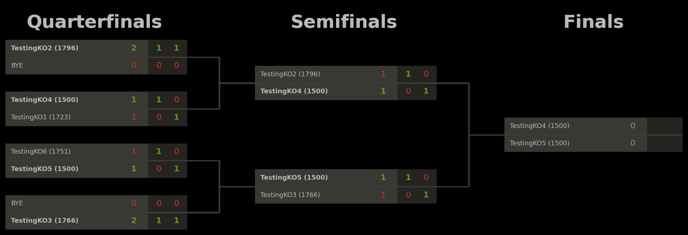

# Lichess Knock-Out Tournament Tool
This repository provides a tool to automatically run (single-elimination) knock-out tournaments on Lichess, making use of Lichess Swiss tournaments with manually-provided pairings. Visualizations of the knock-out brackets are automatically visualized and kept up-to-date, and hosted on GitHub, with a direct link in the tournament description.

## Demos
Below are some examples of tournaments which were run with this tool, and the associated brackets.

#### 1. Example tournament (8 players, 2 games per round)
[Tournament URL](https://lichess.org/swiss/exMmShZ3) 

#### 2. Example bracket (256 players, 4 games per round)
(Simulated data)

## Requirements
To use this, you need to have a Lichess account, and you need to be the team leader of a Lichess team. To run the script in the cloud, you further need a GitHub account. The below description is for the cloud instantiation, as it provides the full functionality of automated visual knock-out bracket generation (similar to e.g. [Challonge](https://challonge.com)) which gets hosted on GitHub and linked in the tournament description, for players to track the progress of the tournament.

For users to join, they need to be a member of the same team in which these tournaments are organized.

## Installation (short version)

1. Clone this GitHub repository, say to `yourname/lichess-knockout`.
2. Create a GitHub token [here](https://github.com/settings/tokens?type=beta).
3. Create a Lichess token [here](https://lichess.org/account/oauth/token/create?scopes[]=tournament:write&description=Knockout%20Tournament%20Token).
4. Store these tokens as secrets `GITHUBTOKEN` and `LICHESSTOKEN` in the GitHub Actions of the repository.
5. Configure the GitHub and Lichess settings in `config.ini`.
6. *(optional)* Configure the other settings in `config.ini` as desired.
7. The script should now be ready and will automatically start running and create a new tournament.

## Installation (long version)

1. Clone this GitHub repository, say to `yourname/lichess-knockout`.
2. Create a GitHub token [here](https://github.com/settings/tokens?type=beta).
   - Choose any token name.
   - For expiration, select a year from now for a long-lasting token.
   - Under repository access, select "Only select repositories" and select the repository you just created.
   - Leave the other default options and click "Generate token".
   - You will see the token in the form of one long string starting `github_...`. **Save this string**, you will need it later.
3. Create a Lichess token [here](https://lichess.org/account/oauth/token/create?scopes[]=tournament:write&description=Knockout%20Tournament%20Token).
   - Choose any token name.
   - The only required permission is `tournament:write` and this should automatically be selected when clicking this link.
   - Leave the other boxes unchecked and click "Create token".
   - You will see the token in the form of one long string starting `lip_...`. **Save this string**, you will need it later.
4. Store these tokens as secrets `GITHUBTOKEN` and `LICHESSTOKEN` in the GitHub Actions of the repository.
   - One way to go there is to navigate directly to `https://github.com/{yourgithubname}/{yourclonedreponame}/settings/secrets/actions`.
   - Alternatively, navigate to your newly cloned repository on GitHub, choose "Settings" in the top menu, and choose "Secrets and variables" - "Actions" in the left menu.
   - When you reach the right page, make two secrets for the Lichess and GitHub tokens.
       - Click "New repository secret"; use name `GITHUBTOKEN`; paste the GitHub token starting `github_...`; and click "Add secret".
       - Click "New repository secret"; use name `LICHESSTOKEN`; paste the Lichess token starting `lip_...`; and click "Add secret".
5. Configure the GitHub and Lichess settings in `config.ini`.
   - In the repository, find the file `config.ini` and (if doing this through the browser) edit it by clicking the pencil in the top right corner.
   - Under the header [GitHub], paste your GitHub username and GitHub repository name in the appropriate places.
   - Under the header [Lichess], paste the last part of the URL of the team where these tournaments will be hosted.
       - Example: For the team `The Cult` with URL `https://lichess.org/team/the-cult` you would use `the-cult`.
6. *(optional)* Configure the other settings in `config.ini` as desired.
   - In the same file `config.ini`, other parameters under [Options] can be modified to change various tournament settings.
7. The script should now be ready and will automatically start running and create a new tournament.
   - Progress can be followed under the Actions-tab, where an instance of the Tournament Runner will appear.
   - Once the script starts running, you will see the new tournament appear on your team page on Lichess.

## Changing the tournament parameters
The file `config.ini` can be modified to change the parameters of the tournament. For most of these parameters, the same restrictions apply as on the corresponding [Lichess API endpoint](https://lichess.org/api#tag/Swiss-tournaments/operation/apiSwissNew). Some additional details on (the requirements on) these parameters are given below.
- The field `EventName` describes the name for the tournament on Lichess, and is bound by the same constraints as specified in the Lichess API. In particular, special characters (including e.g. exclamation marks) should be avoided, and the maximum length of the tournament name is 30 characters.
- The field `TieBreak` can be set to decide who wins in case a match ends in a tie: the player with the lowest rating (`rating`), or the player with fewer white games (`color`, but only in combination with an odd `GamesPerMatch`).
- The field `MinutesToStart` specifies how soon the event starts after this script starts running. Concretely, this therefore specifies how long the tournament is open for registration on Lichess. To schedule 
- The time control `ClockInit` and `ClockInc` must satisfy constraints specified by the Lichess API.
- The minimum number of participants is 4; a tournament with fewer players will be automatically cancelled.
- The maximum supported number of participants is currently 2048, but anything above 16 is currently not 100% tested and may potentially break.

## Changing the frequency of tournaments
To change how often the script runs (and creates a tournament, waits for the start, keeps track of the event, sends pairings to Lichess, etc.), one has to edit the schedule in the GitHub Actions specification, at `.github/workflows/runner.yml`. The format of the schedule is given in the Cron format. A useful tool for finding a suitable Cron format for your desired frequency is [Crontab.guru](https://crontab.guru/). Some examples of schedules:
- `0 * * * *`: At the start of every hour.
- `30 * * * *`: Half an hour past every hour.
- `0 */2 * * *`: At the start of every even hour.
- `0 1-23/2 * * *`: At the start of every odd hour.
- `0 */4 * * *`: Every 4 hours.
- `0 8,18,22 * * *`: Every day at 08:00, 18:00, and 22:00.
- `30 20 * * 6`: At 20:30 on every Saturday.

**Note**: These times are when the script starts running; **not** when the event starts. If you want to run knock-out events every evening at 20:00 with a 2-hour registration period, you would set `MinutesToStart: 120` in `config.ini`, and schedule the script to start running two hours before the start of the event, e.g., using `0 18 * * *`.

**Additional note**: The Lichess API and GitHub Actions have rate limits on how often you can query the API, how often you can run these schedules, and how many tournaments can be created. Setting the schedule to create a knock-out tournament every 5 minutes will likely result in Lichess rate-limiting your access to the API, and in extreme cases blocking your ability to create tournaments altogether.
  
## Multiple time schedules
In some cases, a single schedule may not be sufficient. For instance, if you want to run a daily blitz event at 18:00 and a daily bullet event at 22:00, you need two different configurations. Since the GitHub Actions script calls the main python script and passes on the name of the configuration file as one of the arguments, one can create several independent schedules by:
1. Copying `config.ini` to `config-2.ini` and editing this configuration file, with different tournament settings;
2. Copying `.github/workflows/runner.yml` to `.github/workflows/runner-2.yml`, updating the Cron schedule for this series of tournaments, and replacing `config.ini` in this script with `config-2.ini`.

GitHub Actions will automatically pick up on the new `.yml` file if it is placed inside this directory, and will automatically run these scripts at the scheduled times.

## Design considerations
The solution in this script, to host knock-out tournaments as Swiss events is a disguise, comes with benefits as well as drawbacks.

On the positive side, this solution means that users can easily find and join the event via the corresponding Lichess Swiss event, and the script will make sure to include a link to the up-to-date knockout bracket in the tournament description. This means that events are easy to find for users, and that they do not have to leave Lichess to find information about the event (except for viewing the bracket, hosted externally). The time until the tournament starts and until new rounds start can also be easily tracked via the Swiss event. Moreover, using the Swiss functionality means that no complicated authorization flows are needed to make manual pairings between users and force them to play games - we can simply provide the pairings to Lichess directly via the Lichess API for Swiss events, and Lichess will make sure the right players will play against one another. Lichess will automatically handle absent players, and assign wins to the opponents if needed.

On the negative side, this (unofficial) solution via Swiss events means that Lichess will think it is hosting a Swiss event, rather than a knock-out event. Therefore, on the tournament page, Lichess will rank players based on their total points, which may not reflect the players' standings in the knock-out bracket - someone winning their first match 2-0 and losing 1-1 on tiebreaks in the second match has more points than someone winning 1.5-0.5 and winning 1-1 on tiebreaks.

The latter drawback of inconsistent rankings can potentially be overcome if Lichess allows Swiss tournament organizers to overrule the standard scoring of events. Allowing scoring to be altered would potentially open up the Swiss system to abuse of tournament organizers who manipulate the scoring system to make certain players win/lose, but it would also allow knock-out events to be scored properly.
